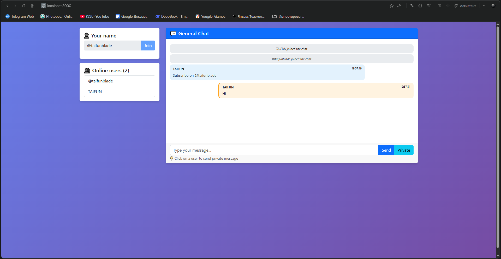
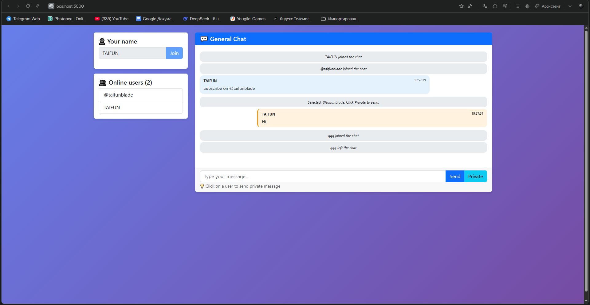

# 💬 SignalR Chat - Real-time messaging

<div align="center">


**Real-time chat application with private messages**

</div>

---

## 📖 About

Real-time chat built with ASP.NET Core SignalR. Supports public chat, private messages, and online user list.

---

## ✨ Features

| Feature | Description |
|--------|-------------|
| 💬 Real-time messages | Instant messaging without page refresh |
| 👤 User join/leave notifications | See who's online |
| 🔒 Private messages | Send direct messages to users |
| 👥 Online users list | See all active users |
| 🐳 Docker ready | Run with single command |

---

## 🚀 Quick Start

### With Docker

```bash
docker-compose up -d
```

Open http://localhost:5000

### Without Docker

```bash
dotnet run
```

---

## 📸 Screenshots

<div align="center">
  
  
</div>

---

## 🛠️ Tech Stack

- [ASP.NET](https://asp.net/) Core 8  
- SignalR  
- Bootstrap 5  
- Docker
